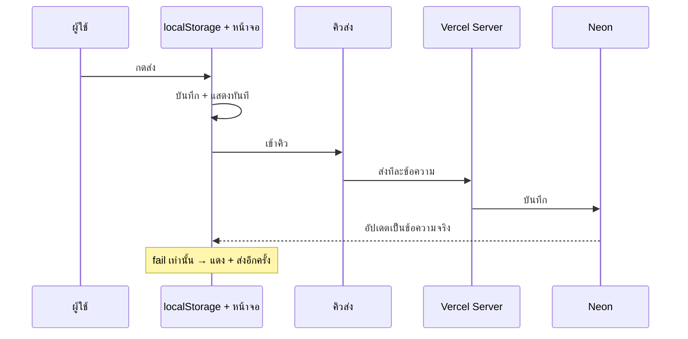

# บันทึก: ปัญหาการส่งข้อความใน Chat และ UI ไม่อัปเดตตาม

_กรกฎาคม 2026_

เอกสารนี้สรุปปัญหา **ส่งข้อความแล้ว UI ไม่ตรงกับความจริง** (หาย, เหลือแค่ข้อความล่าสุด, ต้อง refresh) รวมสาเหตุและวิธีแก้ที่ทำในโปรเจกต์

ดูเรื่อง **ความรู้สึกช้าตอนกดส่งครั้งแรก** ได้ที่ [`chat-send-delay-learnings.md`](./chat-send-delay-learnings.md)

---

## อาการที่เจอ

| อาการ | ตัวอย่าง |
|--------|----------|
| ส่งหลายข้อความเร็ว ๆ แล้วเหลือแค่ข้อความล่าสุดบนจอ | ส่ง `h` หรือ `hello six seven` ติด ๆ กัน 5–6 ครั้ง |
| ต้อง **refresh** ถึงจะเห็นข้อความครบ | หลัง refresh เห็นทุกข้อความใน DB |
| ขึ้น **"กำลังส่ง..."** นานมาก | ข้อความท้าย ๆ ค้างสถานะกำลังส่ง |
| ส่งแล้วรู้สึกว่า **ไม่ไป** | ข้อความหายจากหน้าจอ (rollback) |
| Server error ทั้งหน้า | ส่งเร็วมาก ๆ แล้ว popup error จาก Next.js |

---

## สาเหตุหลัก (เข้าใจง่าย)

### 1. แสดงชั่วคราวใน memory — ไม่ได้เก็บในเครื่อง

```
กดส่ง → แสดงบนจอทันที (Optimistic UI)
      → ส่งไป server
      → server fail → ข้อความหายจากจอ (rollback)
```

- เก็บแค่ใน **RAM** ของ browser
- ไม่มี **localStorage / IndexedDB** เหมือน Line
- ผู้ใช้เลยรู้สึกว่า "ส่งไม่ไป"

### 2. ส่งพร้อมกันหลายครั้ง → cache ชนกัน (Race condition)

เมื่อใช้ Optimistic UI + SWR `mutate` แบบ **ไม่มีคิว**:

```
ส่ง 1, 2, 3, 4, 5, 6 พร้อมกัน
     ↓
แต่ละครั้งพยายามอัปเดตรายการข้อความบนจอ
     ↓
อันหลังทับอันก่อน (อ่าน cache เก่า)
     ↓
เหลือแค่ข้อความที่อัปเดตทีหลังสุดบนจอ
```

**สำคัญ:** ข้อความอาจ **บันทึกใน DB ครบแล้ว** แต่ **หน้าจอแสดงผิด** — เลย refresh แล้วเห็นหมด

### 3. ส่งทีละ server round-trip แต่โชว์ "กำลังส่ง..." ทุกข้อความในคิว

หลังเพิ่มคิวส่งทีละข้อความ:

- ข้อความที่ 1 รอ server ~0.5–2 วิ
- ข้อความที่ 2–6 **รอในคิว** แต่ยังแสดง "กำลังส่ง..."
- รู้สึกช้าและไม่เหมือน Line

### 4. ฝั่งรับยังใช้ Polling — ไม่ใช่ WebSocket

- ข้อความใหม่จากคนอื่นมาทุก **1 วินาที** (ไม่ทันที)
- บางทีรู้สึกว่า "ส่งไม่ไป" ทั้งที่ฝั่งรับแค่ยังไม่ poll ทัน

### 5. โหลดข้อมูลช้าตอนเปิดห้อง (คนละเรื่อง แต่เกี่ยวข้อง)

- เดิมไม่มี prefetch → เปิดห้องแล้วพื้นที่แชทว่าง
- แก้ด้วย server prefetch แล้ว (ดูส่วน "วิธีแก้" ด้านล่าง)

---

## ทำไม Line / Messenger ไม่เป็นแบบนี้

| | Line / Messenger | แอปเรา (ก่อนแก้ครบ) |
|---|------------------|----------------------|
| เก็บในเครื่องก่อน | ใช่ (SQLite / IndexedDB) | ไม่ |
| ส่งทีละข้อความในพื้นหลัง | ใช่ (คิว) | ไม่ — ยิงพร้อมกัน |
| แสดงบนจอ | ทันที ไม่ขึ้น "กำลังส่ง..." | แสดงแล้วหาย / ค้างกำลังส่ง |
| ส่งไม่สำเร็จ | แจ้ง error ข้อความยังอยู่ | rollback ข้อความหาย |
| ฝั่งรับ | WebSocket push | Polling |

**สรุป:** Line ก็ส่งทีละข้อความในพื้นหลังเหมือนกัน แต่ **โชว์ข้อความทันที** และ **เก็บในเครื่องก่อน** ไม่ให้หาย

---

## วิธีแก้ที่ทำไป (ลำดับเวลา)

### ขั้นที่ 1 — Optimistic UI

**ปัญหา:** กดส่งแล้วต้องรอ server ถึงจะเห็นข้อความ

**แก้:** แสดงข้อความทันที แล้วค่อย `postChannelMessage` ในพื้นหลัง

**ไฟล์:** `components/collaboration/collaboration-chat-panel.tsx`

**ผล:** ฝั่งคนส่งรู้สึกเร็วขึ้น แต่ยังมีปัญหาส่งเร็ว ๆ แล้ว UI พัง

---

### ขั้นที่ 2 — ลด Polling + Server Prefetch

**ปัญหา:** เปิดแชทช้า / คลิกห้องแล้วว่าง

**แก้:**
- Polling จาก 5 วิ → **1 วิ**
- **Prefetch** channels + members + ข้อความทุกห้อง ตอน login (`getCollaborationBootstrap` ใน `app/layout.tsx`)

**ไฟล์:**
- `lib/collaboration/queries.ts`
- `lib/collaboration/collaboration-provider.tsx`
- `app/layout.tsx`

**ผล:** เปิดห้องแล้วเห็นข้อความเร็วขึ้น (ไม่ต้องรอ fetch หลังคลิก)

---

### ขั้นที่ 3 — Outbox Queue + เก็บในเครื่อง (localStorage)

**ปัญหา:** ส่งเร็ว ๆ หลายครั้ง → UI เหลือแค่ข้อความล่าสุด / ต้อง refresh

**แก้:**
- บันทึกข้อความลง **localStorage** ทันทีที่กดส่ง
- **คิวส่งทีละข้อความ** ไป server (ไม่ยิงพร้อมกัน)
- สถานะ **failed** เท่านั้นที่แสดงบนจอ (+ ปุ่ม "ส่งอีกครั้ง")

**ไฟล์:**
- `lib/collaboration/chat-outbox.ts`
- `lib/collaboration/use-chat-send-queue.ts`
- `components/collaboration/collaboration-chat-panel.tsx`

**ผล:** ส่งติด ๆ กันแล้วเห็นครบทุกข้อความบนจอ ไม่ต้อง refresh

---

### ขั้นที่ 4 — ไม่แสดง "กำลังส่ง..." (UX แบบ Line)

**ปัญหา:** ข้อความในคิวขึ้น "กำลังส่ง..." นาน

**แก้:** แสดงข้อความเป็นปกติทันที — คิวทำงานในพื้นหลังเงียบ ๆ แจ้งเฉพาะตอน **ส่งไม่สำเร็จ**

**ไฟล์:** `lib/collaboration/use-chat-send-queue.ts`, `collaboration-chat-panel.tsx`

**ผล:** รู้สึกเหมือน Line — กดส่งแล้วเห็นข้อความเลย

---

### ขั้นที่ 5 — ลบข้อความแล้วหายจากแชท

**ปัญหา:** ลบแล้วยังเห็นกล่อง "ข้อความถูกลบ"

**แก้:** กรอง `deletedAt` ออกจากรายการที่แสดง

**ไฟล์:** `collaboration-chat-panel.tsx`

---

### ขั้นที่ 6 — ปุ่มส่งไม่ถูก block ระหว่างรอ server

**ปัญหา:** กดส่งแล้วปุ่มส่งกดไม่ได้จนกว่า server จะตอบ

**แก้:** ลบ state `submitting` — ส่งต่อเนื่องได้ทันที

---

## Flow หลังแก้ครบ



---

## เปรียบเทียบก่อน vs หลัง

| หัวข้อ | ก่อนแก้ | หลังแก้ |
|--------|---------|---------|
| กดส่งแล้วเห็นข้อความ | รอ server | ทันที |
| ส่งเร็ว ๆ 5–6 ครั้ง | เหลือแค่ล่าสุดบนจอ | เห็นครบ |
| ต้อง refresh เพื่อเห็นครบ | บ่อย | ไม่จำเป็น |
| เก็บในเครื่อง | ไม่ | localStorage (outbox) |
| ส่งทีละข้อความไป server | ไม่ (พร้อมกัน) | ใช่ (คิว) |
| แสดง "กำลังส่ง..." | ไม่มี → มีช่วงหนึ่ง → **ไม่มีแล้ว** | ไม่แสดง (แบบ Line) |
| ส่ง fail | ข้อความหายเงียบ ๆ | แดง + ส่งอีกครั้ง |
| ลบข้อความ | เห็น "ข้อความถูกลบ" | หายจากแชทเลย |
| เปิดห้องแชท | ว่างแล้วรอ fetch | prefetch ตอน login |
| ฝั่งรับเห็นข้อความใหม่ | Polling 1 วิ | Polling 1 วิ (ยังไม่ real-time) |

---

## ไฟล์ที่เกี่ยวข้อง

| ไฟล์ | บทบาท |
|------|--------|
| `components/collaboration/collaboration-chat-panel.tsx` | UI แชท, ส่ง, แสดง bubble |
| `lib/collaboration/chat-outbox.ts` | เก็บข้อความรอส่งใน localStorage |
| `lib/collaboration/use-chat-send-queue.ts` | คิวส่งทีละข้อความ + merge กับ server |
| `lib/collaboration/queries.ts` | Prefetch ตอน login |
| `lib/collaboration/collaboration-provider.tsx` | SWR fallback จาก server |
| `app/layout.tsx` | เรียก bootstrap ตอนโหลดแอป |

---

## สิ่งที่ยังไม่ได้แก้

1. **Real-time ฝั่งรับ** — ยัง polling ทุก 1 วิ ไม่ใช่ WebSocket (ต้องใช้ Pusher/Ably ถ้าต้องการเหมือน Line 100%)
2. **ความเร็ว server** — แต่ละข้อความยังรอ Vercel + Neon (~0.5–2 วิ) ในพื้นหลัง
3. **ส่งเร็วมาก ๆ + server overload** — อาจยัง error ได้ถ้ายิง server หนักเกิน (คิวช่วยแล้วแต่ไม่ใช่ magic)
4. **IndexedDB** — ใช้ localStorage สำหรับ outbox ยังไม่เท่า native app ของ Line

---

## จำไว้ 4 ข้อ

1. **UI ไม่อัปเดต ≠ server ไม่รับ** — มักเป็น cache ชนกัน หรือ optimistic rollback
2. **Refresh เห็นครบ** = ข้อความอยู่ใน DB แล้ว แค่หน้าจอแสดงผิด
3. **Line ไม่ได้เร็วกว่าเพราะ magic** — แค่เก็บในเครื่องก่อน + ไม่โชว์ "กำลังส่ง"
4. **WebSocket ไม่แก้ปัญหาส่งแล้ว UI พัง** — แก้ด้วยคิว + local outbox

---

*อัปเดต: กรกฎาคม 2026*
