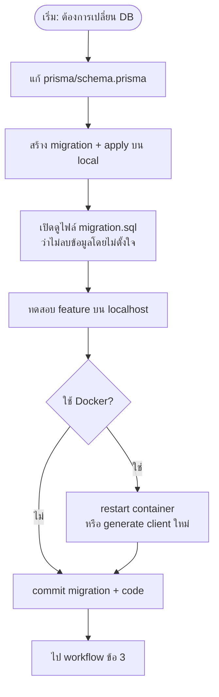
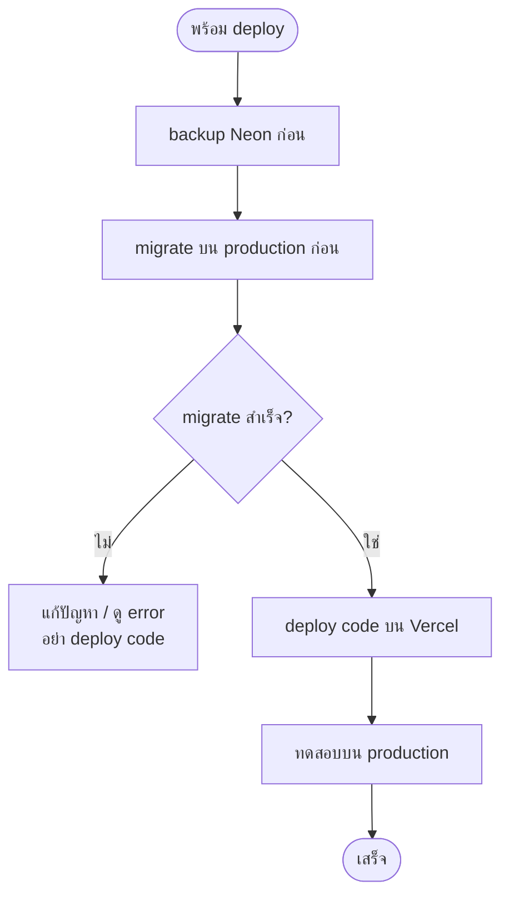
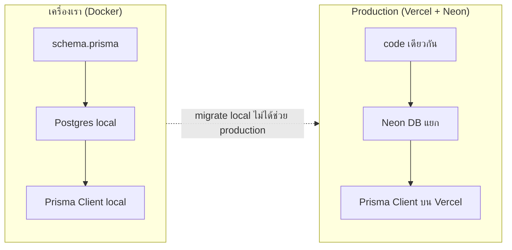
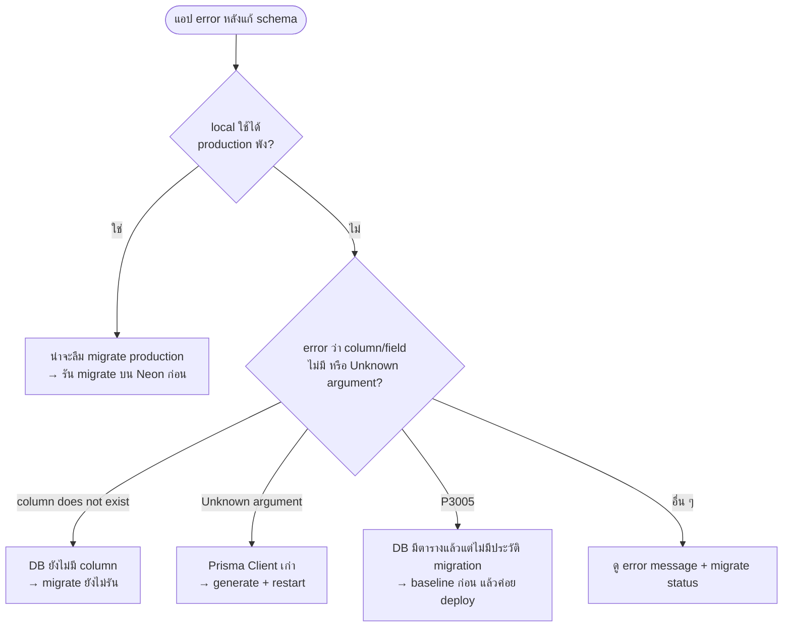
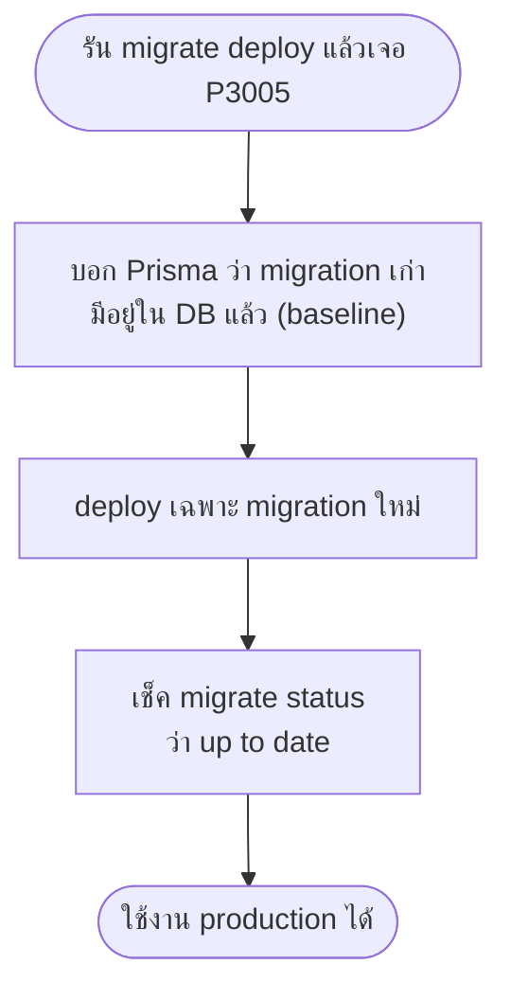

# บันทึกการเรียนรู้เรื่อง Database Migration

_เขียนเมื่อ กรกฎาคม 2026 — จากประสบการณ์จริงในโปรเจกต์ iDea Content_

---

## ไฟล์แบบไหนเหมาะกับการบันทึกการเรียนรู้?

ถ้าต้องการให้ **คนอ่านแล้วเข้าใจ** ไม่ใช่ให้เครื่องรันคำสั่ง — แนะนำแบบนี้:

| รูปแบบ | เหมาะกับ | ข้อดี | ข้อเสีย |
|--------|----------|-------|---------|
| **`.md` (Markdown)** | บันทึกการเรียนรู้, คู่มือทีม | อ่านใน GitHub/Cursor สวย, มีหัวข้อ/ตัวหนาได้, ยังเป็น text ธรรมดา | ถ้าเขียนแบบ checklist + code block เยอะ จะรู้สึกเหมือนคู่มือเครื่อง |
| **`.txt`** | โน้ตสั้น ๆ | เปิดได้ทุกที่ | จัดรูปแบบยาก อ่านยาว ๆ ลำบาก |
| **`.md` แบบเล่าเรื่อง** | **แนะนำสำหรับโปรเจกต์นี้** | ได้ทั้งความอ่านง่ายและ version control | ต้องตั้งใจเขียนเป็นภาษาคน |

**สรุป:** ใช้ `.md` ต่อไปได้ — แค่เปลี่ยนวิธีเขียนจาก "รายการคำสั่ง" เป็น "เล่าเรื่องที่เรียนรู้" แบบเอกสารด้านล่างนี้

ถ้าอยากแยกชัด ๆ ในโปรเจกต์ อาจใช้ชื่อแบบนี้:
- `docs/learnings/` — บันทึกประสบการณ์ (ภาษาคน)
- `docs/runbooks/` — ขั้นตอนเทคนิค (คำสั่งละเอียด)

---

## เราเคยคิดผิดเรื่องอะไร?

ตอนแรกเราคิดว่า แก้ `schema.prisma` แล้ว commit ขึ้นไป ทุกอย่างน่าจะตามมาเอง

แต่จริง ๆ แล้วมี **สามส่วน** ที่ต้องตรงกัน:

1. **แบบแปลน** — ไฟล์ `prisma/schema.prisma` ที่เราเขียน
2. **ฐานข้อมูลจริง** — Postgres บน Docker (local) หรือ Neon (production)
3. **ตัวกลางที่ app เรียกใช้** — Prisma Client ใน `node_modules`

สามส่วนนี้ **ไม่อัปเดตพร้อมกันอัตโนมัติ** แค่แก้แบบแปลน ไม่ได้แปลว่า database หรือ client เปลี่ยนตาม

นี่คือเหตุผลที่ localhost ใช้ได้ แต่ production พัง — หรือ Docker error ทั้งที่ code ดูถูกแล้ว

---

## Workflow ที่ใช้จริง (อ่านตามลำดับ)

### 1) ภาพรวม — สามส่วนที่ต้องตรงกัน

ทุกครั้งที่แก้ database ให้นึก flow นี้:


ถ้าข้ามขั้นไหน แอปอาจ error ทั้งที่ code ดูถูกแล้ว

---

### 2) พัฒนาบนเครื่องตัวเอง (local / Docker)

ใช้ทุกครั้งที่เพิ่ม column, status, หรือ table ใหม่:



**จุดที่มักลืม:** แก้ schema แล้วไม่ restart Docker → client เก่า → error แบบ `Unknown argument ...`

---

### 3) ขึ้น production (ลำดับสำคัญ)



**กฎเดียวที่ต้องจำ:** DB ก่อน → code ทีหลัง

```
  ❌ deploy code ก่อน → user เจอ error
  ✅ migrate production ก่อน → deploy code → ปลอดภัย
```

---

### 4) local กับ production เป็นคนละที่



migrate บนเครื่องตัวเอง **ไม่ได้** ทำให้ Neon อัปเดตตาม — ต้อง migrate แยกบน production ทุกครั้ง

---

### 5) เจอปัญหาแล้วไม่รู้ว่าเกิดจากอะไร

ใช้ flow นี้ไล่เช็ค:



---

### 6) ครั้งแรกที่ production ยังไม่มีประวัติ migration

กรณีพิเศษ — ใช้ครั้งเดียวตอน setup production ครั้งแรก:



ในโปรเจกต์นี้มีสคริปต์ช่วย: `scripts/production-db-upgrade.sh`

---

## เรียนรู้อะไรจากเหตุการณ์จริง

### เหตุการณ์ที่ 1: สร้าง content บน production ไม่ได้

**ที่เกิดขึ้น:** deploy code ขึ้น Vercel แล้ว กดสร้าง content ไม่ได้ error ว่าไม่มี column `createdById`

**ที่เข้าใจทีหลัง:** code บน Vercel ใหม่กว่า database บน Neon — เราเพิ่ม column ใน schema แล้ว แต่ลืมรัน migration บน production

อีกปัญหาคือ production เคยถูกสร้างด้วยวิธีที่ Prisma ไม่มีประวัติ migration (ไม่มีตาราง `_prisma_migrations`) เลยรัน `migrate deploy` ตรง ๆ ไม่ได้ ต้อง "บอก" Prisma ก่อนว่า migration เก่า ๆ มีอยู่แล้ว (เรียกว่า baseline)

**สิ่งที่จำไว้:** local กับ production เป็นคนละ database — migrate บนเครื่องตัวเอง ไม่ได้ทำให้ production อัปเดตตาม และต้อง migrate production ก่อน deploy code ใหม่

---

### เหตุการณ์ที่ 2: Admin กดอนุมัติแล้ว error

**ที่เกิดขึ้น:** กดปุ่มอนุมัติ ขึ้น error `Unknown argument postError`

**ที่เข้าใจทีหลัง:** เราเพิ่ม field `postError` ใน schema แล้ว แต่ Prisma Client ใน Docker container ยังเป็นเวอร์ชันเก่า

Docker mount code เข้ามาใหม่ทันที แต่ `node_modules` (ที่ Prisma Client อยู่) ไม่ได้ regenerate เอง — ต้องรัน `prisma generate` หรือ restart container

**สิ่งที่จำไว้:** แก้ schema แล้ว ต้อง generate client ใหม่เสมอ โดยเฉพาะตอนพัฒนาผ่าน Docker

---

### เหตุการณ์ที่ 3: Feature ใหม่ใช้ได้ local แต่ production ยัง error

**ที่เกิดขึ้น:** เพิ่ม status `post_failed` ใช้ได้บน localhost แต่ production ยังไม่รู้จัก

**ที่เข้าใจทีหลัง:** เหมือนเหตุการณ์ที่ 1 — ลืม deploy migration บน Neon ก่อน deploy code

**สิ่งที่จำไว้:** ทุกครั้งที่เพิ่ม column หรือ status ใหม่ ต้องมีไฟล์ migration และรันบน production ด้วย ไม่ใช่แค่ local

---

## หลักการที่เราใช้ต่อจากนี้

**ลำดับที่ถูกเวลาจะ deploy**

อัปเดต database บน production ก่อน แล้วค่อย deploy code ทีหลัง ถ้าสลับกัน user จะเจอ error จนกว่า DB จะตาม

**สิ่งที่ไม่ทำบน production**

เราไม่ใช้ `db push --accept-data-loss` เพราะเสี่ยงลบ column หรือข้อมูลทิ้ง และไม่ใช้ `migrate reset` เพราะลบข้อมูลทั้งหมด บน production ใช้แค่ `migrate deploy` ผ่านไฟล์ migration ที่ review แล้ว

**การเขียน migration ที่ปลอดภัย**

เน้นเพิ่มของใหม่ (column, enum value) มากกว่าลบของเก่า ถ้าเพิ่ม column ที่บังคับกรอก ต้องใส่ค่า default ให้ row เก่าไม่พัง และใช้ `IF NOT EXISTS` เมื่อเหมาะสม เพื่อรันซ้ำได้โดยไม่พัง

**ก่อนแตะ production**

สร้าง backup บน Neon (branch หรือ snapshot) ก่อนรัน migration ทุกครั้ง

ดู workflow ลำดับ deploy ได้ที่ **ข้อ 3 ด้านบน**

---

## สิ่งที่ต้องทำเมื่อเพิ่ม field / status ใหม่

สรุปสั้น ๆ (รายละเอียดดู workflow **ข้อ 2** และ **ข้อ 3** ด้านบน):

1. แก้ `schema.prisma` แล้วสร้าง migration บน local
2. ทดสอบ feature ที่เกี่ยวข้องบน local (รวม Docker ถ้าใช้)
3. backup Neon
4. รัน migration บน production
5. deploy code
6. ทดสอบบน production อีกรอบ

ถ้าใช้ Docker แล้วแก้ schema ขณะ container รันอยู่ ให้ restart container หรือ generate client ใหม่ — ไม่งั้นอาจเจอ error แบบเหตุการณ์ที่ 2

---

## โปรเจกต์นี้ database อยู่ที่ไหนบ้าง

พัฒนาบนเครื่องใช้ Postgres ใน Docker (`localhost:5432`) ตอน start container จะ migrate และ generate client ให้อัตโนมัติ

production ใช้ Neon บน Vercel — migration ไม่รันเองตอน build ต้องรันแยกด้วยมือ (หรือ CI ถ้าตั้งไว้)

สองที่นี้แยกกันโดยสิ้นเชิง ต้อง migrate ทั้งสองที่เมื่อมี schema ใหม่

---

## อ้างอิงเทคนิค (เมื่อต้องรันคำสั่งจริง)

รายละเอียดคำสั่งและสคริปต์ baseline production ดูได้ที่:

- [`scripts/production-db-upgrade.sh`](../scripts/production-db-upgrade.sh) — ใช้ครั้งแรกเมื่อ production ยังไม่มีประวัติ migration
- [Prisma: Baseline database](https://www.prisma.io/docs/orm/prisma-migrate/getting-started#baseline-your-production-environment)
- [Prisma: แก้ปัญหา production](https://www.prisma.io/docs/orm/prisma-migrate/workflows/troubleshooting)

คำสั่งที่ใช้บ่อย: `bun run db:migrate` (local), `bun run db:deploy` (production), `bun run db:generate` (อัปเดต client), `bunx prisma migrate status` (เช็คว่าค้างไหม)

---

## บทสรุปหนึ่งย่อหน้า

ปัญหา migration ในโปรเจกต์นี้ไม่ได้เกิดจาก Prisma ใช้ยาก แต่เกิดจาก **สามส่วน (schema, database, client) ไม่ sync กัน** และ **local กับ production เป็นคนละ DB** การแก้คือทำตามลำดับ migrate ก่อน deploy code, generate client หลังแก้ schema, และ backup ก่อนแตะ production — ถ้าจำสามข้อนี้ได้ ส่วนใหญ่จะไม่เจอปัญหาซ้ำ
